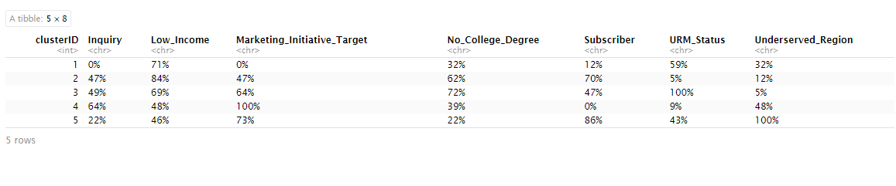

# 📊 Hierarchical Clustering: Event Attendance Analysis

This project uses **hierarchical clustering in R** to analyze behavioral and demographic patterns among event attendees. The goal is to identify distinct audience segments and inform more effective outreach strategies.

---

## 🎯 Objective

Group event attendees by shared traits to better personalize communication, optimize resource allocation, and improve event attendance rates.

---

## 🗂️ Dataset Overview

- **Source**: Query from relational database  
- **Timeframe**: 2021–2024  
- **Sample Size**: 300 attendees  
- **Event Types**: Venue Tours, Fun Fridays, Open Houses  
- **Variables Used (Binary Format)**:
  - Inquiry
  - Subscriber
  - Marketing Initiative Target
  - No College Degree
  - Income < $20,000
  - underserved Region
  - URM (Underrepresented Minority)

> 📝 *Note: Dataset is fictional and created for demonstration purposes.*  
> 📂 *The dataset (`event_attendance.csv`) is included in this repository.*

---

## 🧪 Methodology

- **Software**: RStudio  
- **Technique**: Agglomerative Hierarchical Clustering  
- **Distance Metric**: Manhattan  
- **Linkage Method**: Group Average  
- **Output**: Dendrogram visualization and 5 identified clusters  

### Dendrogram

### Cluster Counts

### Cluster Profiles (% by Variable)

Or, view the text-based Markdown table:  

|   clusterID | Inquiry   | Low_Income   | Marketing_Initiative_Target   | No_College_Degree   | Subscriber   | URM_Status   | Underserved_Region   |
|------------:|:----------|:-------------|:------------------------------|:--------------------|:-------------|:-------------|:---------------------|
|           1 | 0%        | 71%          | 0%                            | 32%                 | 12%          | 59%          | 32%                  |
|           2 | 47%       | 84%          | 47%                           | 62%                 | 70%          | 5%           | 12%                  |
|           3 | 49%       | 69%          | 64%                           | 72%                 | 47%          | 100%         | 5%                   |
|           4 | 64%       | 48%          | 100%                          | 39%                 | 0%           | 9%           | 48%                  |
|           5 | 22%       | 46%          | 73%                           | 22%                 | 86%          | 43%          | 100%                 |

### Example Cross-Tab: No College Degree by Cluster

### Example Cross-Tab: Underserved Region by Cluster

---

## 📌 Key Clusters Identified

### Cluster 1: Economically Disadvantaged, No College Degree
- No college degree  
- Low income  
- 61% underserved region

### Cluster 2: Diverse, Economically Stable Attendees  
- 34% URM  
- 100% have college degrees

### Cluster 3: High Marketing Conversion  
- 100% were leads in targeted marketing  
- All URM  
- All income under $20,000

### Cluster 4: Medically Underserved  
- 98% underserved region  
- Moderate educational/economic mix

### Cluster 5: Low Engagement Inquiries  
- 30% URM  
- All non-subscribers  
- Low marketing and inquiry activity

---

## 💡 Strategic Recommendations

1. **Expand Targeted Marketing**  
   Prioritize high-response segments (Clusters 1, 3, and 4)

2. **Offer Financial Incentives**  
   Use coupons and travel aid for economically disadvantaged segments

3. **Support First-Gen Students**  
   Provide mentorship and tailored onboarding for Cluster 1

4. **Emphasize Representation**  
   Feature URM ads, speakers, and stories in event planning

5. **Strengthen Geo Outreach**  
   Focus campaigns in underserved zip codes aligned with Clusters 1 & 4

---

## 👩‍💼 Author

**Dana Brooks**  
📧 [danatallent@yahoo.com](mailto:danatallent@yahoo.com)  
🔗 [LinkedIn](https://linkedin.com/in/dana-tallent-brooks-a15977a0)

> “When you understand your audience, you don’t have to work as hard to reach them.”
